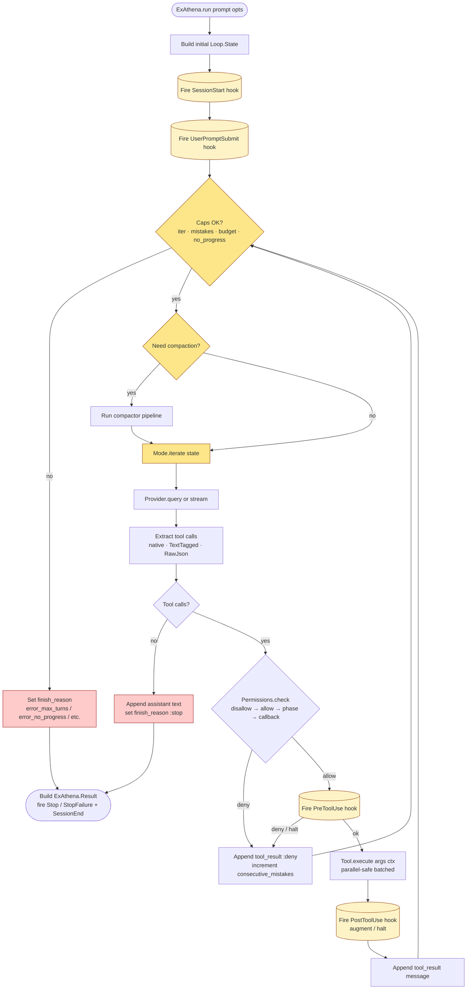
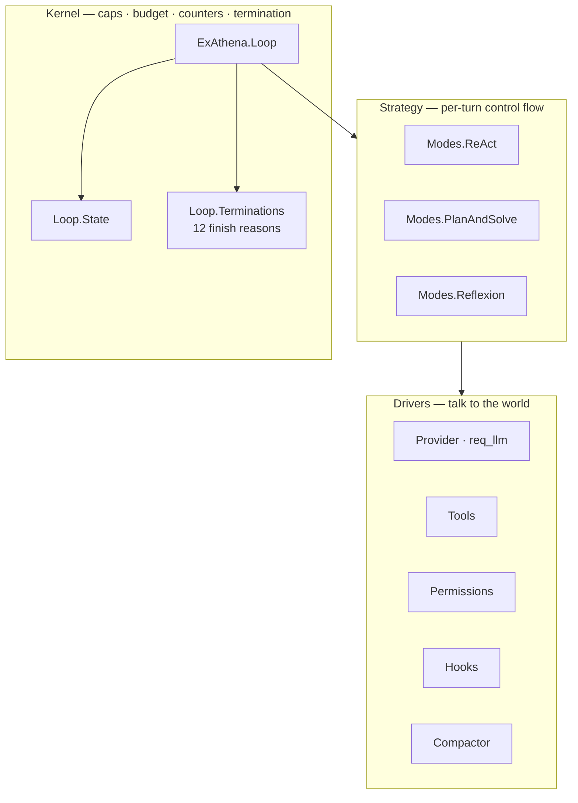

# 01 · Mental Model

> **What this answers:** the one-page picture of how `ExAthena.run(prompt, …)` becomes an answer.
> **Audience:** consumer-first; contributors should still skim before reading [02 · Architecture](02-architecture.md).

---

## The whole story in one diagram

That's it. A turn is: **check caps → maybe compact → run mode → maybe execute tools → loop.** Termination is *always* a typed `finish_reason`.

---

## The three layers

| Layer | Pace of change | Owned by |
|---|---|---|
| **Drivers** | Changes constantly — new providers, new tools, new hooks. | Library + consumer extensions |
| **Strategy** | Stable — three modes today; you add a custom one occasionally. | Library + rare custom modes |
| **Kernel** | Very stable — the contract every Mode and Driver depends on. | Library only |

---

## What ExAthena *is* and *is not*

> "**1.6% reasoning, 98.4% harness.**" The model does the thinking; ExAthena does everything else.

ExAthena is **operational scaffolding** around an LLM:

- ✅ Iteration limits, budget tracking, no-progress detection.
- ✅ Typed termination subtypes for retry classification.
- ✅ Tool dispatch with parallel-safe batching.
- ✅ Deny-first permission gating with 5 phases.
- ✅ 18 lifecycle hook events for intercept / inject / transform.
- ✅ Five-stage compaction pipeline + reactive recovery.
- ✅ Provider-agnostic API across Ollama / OpenAI / Claude / Gemini / llamacpp.
- ✅ Session persistence with resume, rewind, sidechain transcripts.
- ✅ Composable subagents with optional worktree isolation.

ExAthena is **not**:

- ❌ A model. It calls one. You bring the LLM.
- ❌ A vector store. Memory is file-based (`AGENTS.md`/`CLAUDE.md`/`SKILL.md`).
- ❌ A runtime. It runs *inside* your BEAM app.

---

## Where to go next

- **See it play out** → [18 · End-to-end traces](18-end-to-end-traces.md)
- **See the subsystem map** → [02 · Architecture](02-architecture.md)
- **See the kernel mechanics** → [03 · Reasoning loop](03-reasoning-loop.md)
