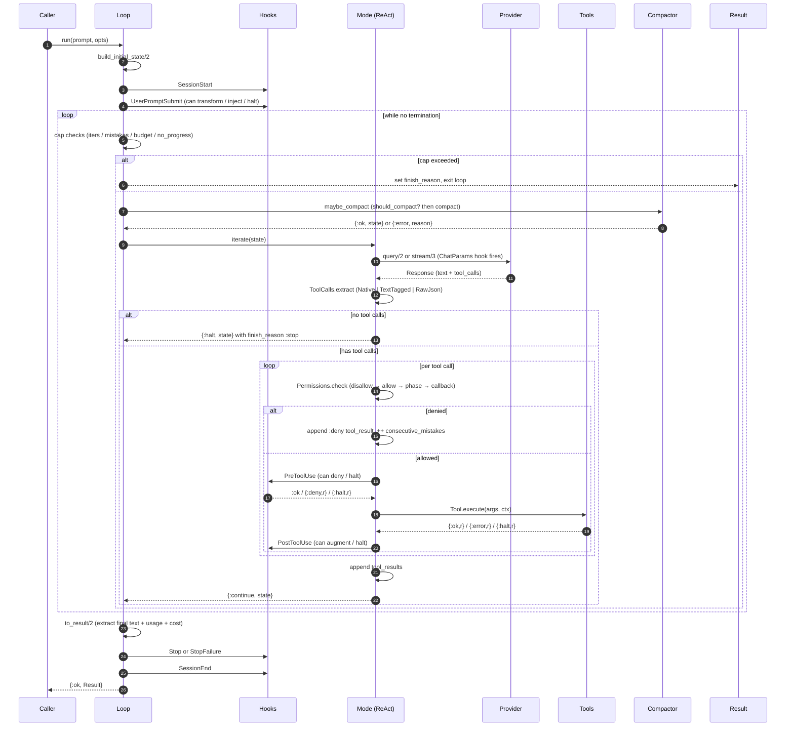
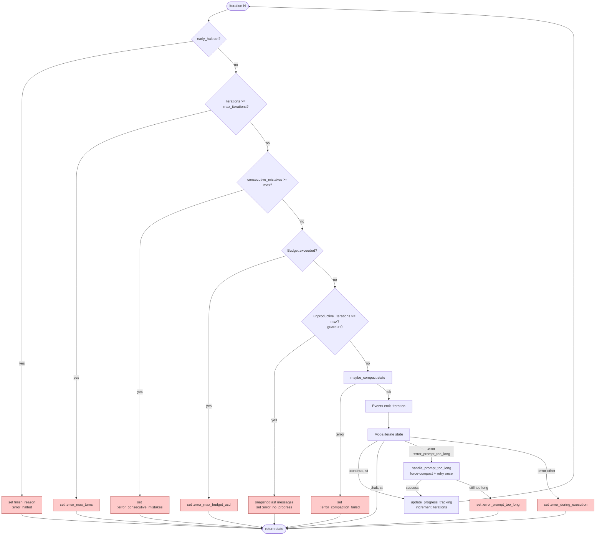
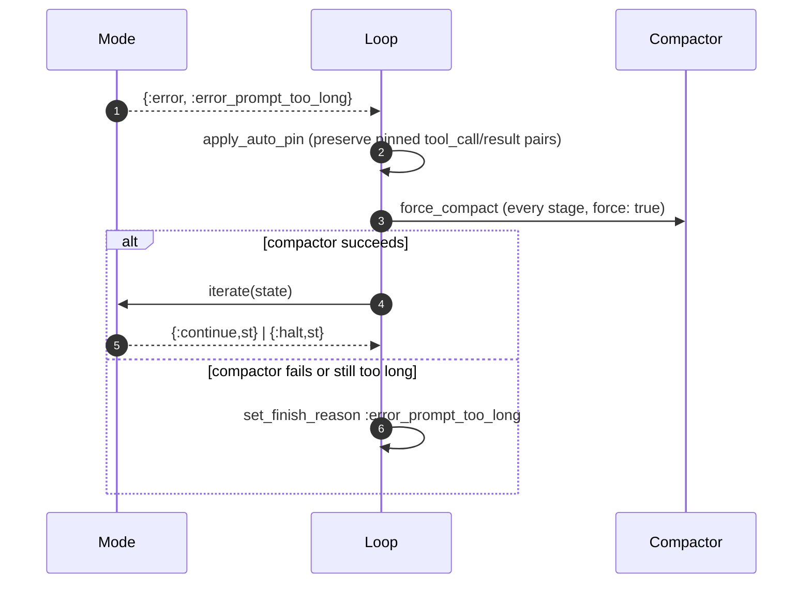

# 03 · Reasoning Loop — Kernel Mechanics

> **What this answers:** what happens inside [`ExAthena.Loop.run/2`](../lib/ex_athena/loop.ex#L93) from the first hook to the final `Result`? What does the kernel decide each turn that the Mode doesn't?
> **Audience:** contributors; advanced consumers debugging surprising terminations.

---

## Top-level sequence



---

## `Loop.run/2` options at a glance

Every option with its default (authoritative list: the [`Loop` moduledoc](../lib/ex_athena/loop.ex#L19)):

```elixir
ExAthena.Loop.run("Add a PORT note to the README",
  # inference
  provider: :exo,                      # required; atom or Provider module
  model: "mlx-community/Qwen3.6-27B",
  system_prompt: nil, temperature: nil, top_p: nil, max_tokens: nil,
  stop: nil, timeout_ms: nil, tool_choice: nil, response_format: nil,
  provider_opts: [],                   # raw passthrough to the provider
  resume: nil,                         # provider-side session id (from Result.session_id)

  # conversation
  messages: [],                        # prior transcript; prompt is appended
  memory: :auto,                       # :auto | false | [Message.t()]
  skills: :auto,                       # :auto | false | %{name => %Skill{}}
  preload_skills: [],                  # activate bodies up-front

  # tools & safety
  tools: :all,                         # :all | [module] | nil → app config
  cwd: nil, phase: nil, assigns: %{},  # → ToolContext
  allowed_tools: nil, disallowed_tools: nil, can_use_tool: nil,
  hooks: %{},

  # reliability knobs
  max_iterations: 25,
  max_consecutive_mistakes: 3,
  max_unproductive_iterations: 3,      # 0 disables the no-progress guard
  max_budget_usd: nil,
  tool_timeout_ms: 60_000,
  max_concurrency: 4,

  # identity & events
  mode: :react,                        # :react | :plan_and_solve | :reflexion | module
  session_id: nil,                     # auto-generated when omitted
  parent_session_id: nil,              # set for subagent runs
  on_event: fn ev -> send(host, {:athena, ev}) end
)
```

---

## Per-iteration decision tree

The body of [`Loop.loop/1`](../lib/ex_athena/loop.ex#L116):



---

## What the kernel owns vs. what the Mode owns

| Concern | Owner | Where |
|---|---|---|
| Iteration cap | Kernel | [`loop.ex:123`](../lib/ex_athena/loop.ex#L123) |
| Mistake counter cap | Kernel | [`loop.ex:127`](../lib/ex_athena/loop.ex#L127) |
| Budget cap | Kernel | [`loop.ex:131`](../lib/ex_athena/loop.ex#L131) |
| No-progress detection | Kernel | [`loop.ex:135`](../lib/ex_athena/loop.ex#L135) + [`compute_tool_fingerprint/2`](../lib/ex_athena/loop.ex#L397) |
| Compaction triggers | Kernel | [`maybe_compact/1`](../lib/ex_athena/loop.ex#L304), [`handle_prompt_too_long/1`](../lib/ex_athena/loop.ex#L177) |
| Lifecycle hook firing (Session*, ChatParams from kernel side, Stop) | Kernel | [`apply_user_prompt_submit/3`](../lib/ex_athena/loop.ex#L608), [`fire_terminal_hooks/2`](../lib/ex_athena/loop.ex#L456) |
| Provider call (query vs stream) | Mode | [`react.ex:78`](../lib/ex_athena/modes/react.ex#L78) |
| Tool-call extraction | Mode | [`ToolCalls.extract/2`](../lib/ex_athena/tool_calls.ex#L48) |
| Permission gate per tool call | Mode | via [`Permissions.check/3`](../lib/ex_athena/permissions.ex#L126) |
| Pre/PostToolUse hook firing | Mode | via [`Hooks.run_pre_tool_use/4`](../lib/ex_athena/hooks.ex#L88), [`run_post_tool_use/4`](../lib/ex_athena/hooks.ex#L106) |
| Parallel-safe batching | Mode + Parallel helper | [`Loop.Parallel.run/3`](../lib/ex_athena/loop/parallel.ex) |
| Setting `finish_reason: :stop` | Mode | [`react.ex:98`](../lib/ex_athena/modes/react.ex#L98) |

The contract between kernel and mode is intentionally tight: `Mode.iterate/1` returns one of three things and the kernel handles the rest.

---

## Reactive recovery — `:error_prompt_too_long`

A Mode can signal "the prompt I tried to send was too big" by returning `{:error, :error_prompt_too_long}`. The kernel then:



The recovery is **one-shot**: if the second iteration still fails, we terminate with `:error_prompt_too_long` (category `:capacity`). This avoids a runaway recompact loop.

You can disable reactive recovery by passing `reactive_compact: false` in the loop opts ([`reactive_compact_opts/1`](../lib/ex_athena/loop.ex#L293)).

---

## No-progress detection

Set by default to 3 consecutive unproductive iterations ([`@default_max_unproductive_iterations`](../lib/ex_athena/loop.ex#L89)). The kernel computes a fingerprint each turn ([`compute_tool_fingerprint/2`](../lib/ex_athena/loop.ex#L397)):

```elixir
# sorted [{tool_name, JSON-encoded args}]
```

A turn is **productive** when *either*:

- The new fingerprint differs from `last_tool_fingerprint`, **or**
- The new messages contain assistant text with `byte_size(c) > 0`.

A Mode may override this signal via [`productivity_signal/2`](../lib/ex_athena/loop/mode.ex#L57) — ReAct does so explicitly ([`react.ex:34`](../lib/ex_athena/modes/react.ex#L34)) with the same default logic, so future Mode implementations can supply richer signals.

When the cap trips, the kernel takes a small snapshot of the last messages and attaches it to `Result.no_progress_snapshot` ([`loop.ex:137`](../lib/ex_athena/loop.ex#L137)) for the caller's remediation reprompt.

Set `max_unproductive_iterations: 0` to disable the guard entirely.

---

## Result assembly

[`to_result/2`](../lib/ex_athena/loop.ex#L422) builds the public `ExAthena.Result`:

```mermaid
flowchart LR
  st[Loop.State<br/>terminal] --> r[ExAthena.Result]
  st --> et[extract_final_text<br/>last assistant content]
  et --> r
  st --> hooks[fire Stop / StopFailure<br/>+ SessionEnd]
  st --> emit[Events.emit :done, result]
  r --> caller([{:ok, Result}])
```

The Result carries: `text`, `messages`, `finish_reason`, `halted_reason`, `error_diagnostic`, `deliverable`, `iterations`, `tool_calls_made`, `usage`, `cost_usd`, `duration_ms`, `model`, `provider`, `session_id` (provider-side conversation id for `resume:`), `no_progress_snapshot`.

When `finish_reason` is `:submitted`, `{:submitted, deliverable}` is emitted just before `{:done, result}` ([`loop.ex:486`](../lib/ex_athena/loop.ex#L486)).

`Stop` fires when the termination is a success; `StopFailure` otherwise. `SessionEnd` always fires last.

---

## Host event vocabulary

Everything a `:on_event` callback can receive ([`lib/ex_athena/loop/events.ex`](../lib/ex_athena/loop/events.ex)), in the shape hosts pattern-match on:

| Event | Example payload | Emitted when |
|---|---|---|
| `{:content, text}` | `{:content, "Added a PORT note "}` | Streaming text delta, or the end-of-turn full text when no deltas streamed. Never emitted for empty text (tool-call-only turns). |
| `{:thinking, text}` | `{:thinking, "I should read the README…"}` | Reasoning-channel delta (or end-of-turn full thinking). |
| `{:tool_call, tc}` | `{:tool_call, %ToolCall{id: "t1", name: "read", arguments: %{"path" => "README.md"}}}` | The model requested a tool — emitted **before** gating/execution, so hosts can render a "running…" state. Identical timing on the Claude Code path (the CLI announces the call before running it). |
| `{:tool_result, tr}` | `{:tool_result, %ToolResult{tool_call_id: "t1", content: "1  # Udin…", is_error: nil}}` | The call finished (success, error, or denial — denials carry `is_error: true`). |
| `{:tool_ui, map}` | `{:tool_ui, %{tool_call_id: "t3", kind: :diff, payload: %{path: "README.md", diff: "…"}}}` | A tool returned the `{:ok, text, %{kind:, payload:}}` split; follows its `:tool_result`. |
| `{:iteration, n}` | `{:iteration, 2}` | A new kernel iteration is starting. |
| `{:compaction, map}` | `{:compaction, %{before: 110_000, after: 45_000, reason: :threshold}}` | Context was compacted (proactive or reactive). |
| `{:subagent_spawn, map}` | `{:subagent_spawn, %{id: "reviewer", prompt: "…"}}` | A sub-agent started. |
| `{:subagent_result, map}` | `{:subagent_result, %{id: "reviewer", text: "Critique: …"}}` | A sub-agent returned. |
| `{:usage, map}` | `{:usage, %{input_tokens: 880, output_tokens: 61}}` | Per-turn usage from the final `Response`. |
| `{:structured_retry, map}` | `{:structured_retry, %{attempt: 2, error: …}}` | `extract_structured` retried after a schema miss. |
| `{:error, reason}` | `{:error, %ExAthena.Error{kind: :server_error}}` | Non-fatal warning; the loop continues. |
| `{:submitted, deliverable}` | `{:submitted, %{"summary" => "…"}}` | The model called `finish`; precedes `{:done, _}`. |
| `{:done, result}` | `{:done, %Result{finish_reason: :stop, …}}` | Terminal — always the last event. |

---

## Contributor notes

- **Counter semantics**: `consecutive_mistakes` is reset at turn boundary on any successful tool execution (ADR — see [`react.ex:118`](../lib/ex_athena/modes/react.ex#L118)). Don't increment it from inside the kernel; the Mode owns it.
- **Immutability**: `State` is a struct — every kernel step returns a new copy. Tests rely on this; never mutate fields in place via dynamic update.
- **`meta` map**: the open extension point. Mode-specific data, hook side-effects (`early_halt`), and compactor knobs (`reactive_compact`, `auto_pin`, `pinned_prefix_count`, `live_suffix_count`) live here. See [`compaction_meta/1`](../lib/ex_athena/loop.ex#L699) for the list of keys the kernel reads.
- **Telemetry**: every `run/2` is wrapped in `[:ex_athena, :loop]`, each provider call in `[:ex_athena, :chat]`, each compaction in `[:ex_athena, :compaction, :stop]`. Hook into these for observability instead of patching the kernel.
- **Result struct vs old map**: as of v0.3 the public return is `ExAthena.Result.t()` — never the raw map. If you see a test using string keys on the return, it's stale.
- **Don't add capacity gates to the Mode**: caps belong to the kernel so every mode gets the same termination contract for free.

---

## Where to go next

- [04 · Modes](04-modes.md) — how ReAct / PlanAndSolve / Reflexion differ on top of this kernel.
- [05 · State & termination](05-state-and-termination.md) — the data the kernel manipulates.
- [12 · Compaction](12-compaction.md) — the pipeline triggered above.
- [18 · End-to-end traces](18-end-to-end-traces.md) — see this flowchart play out on real turns.
