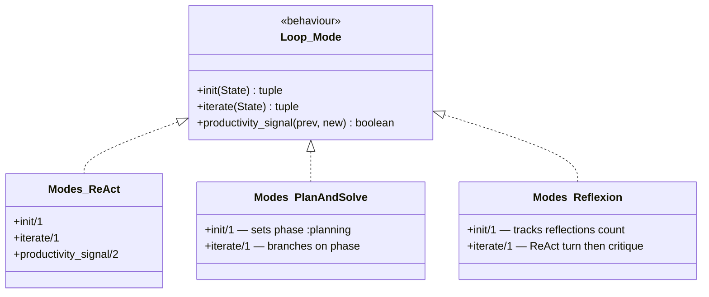
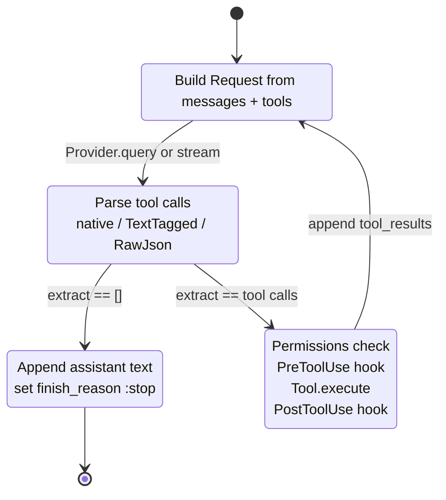
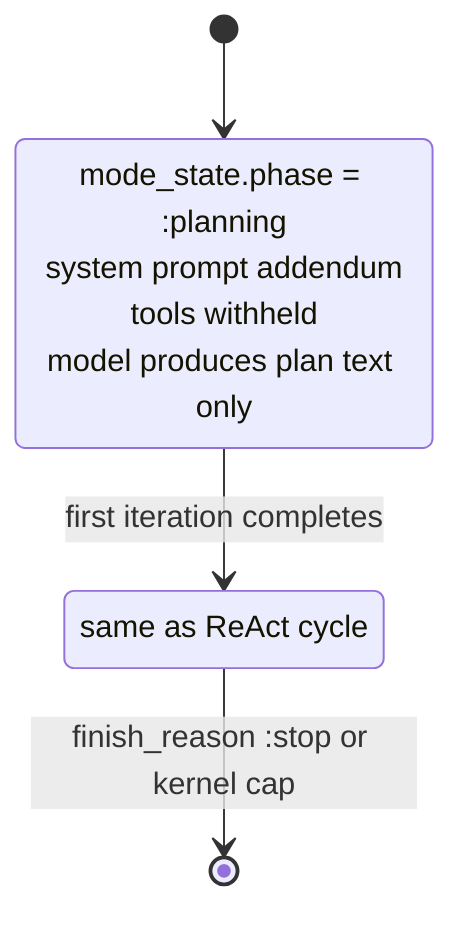
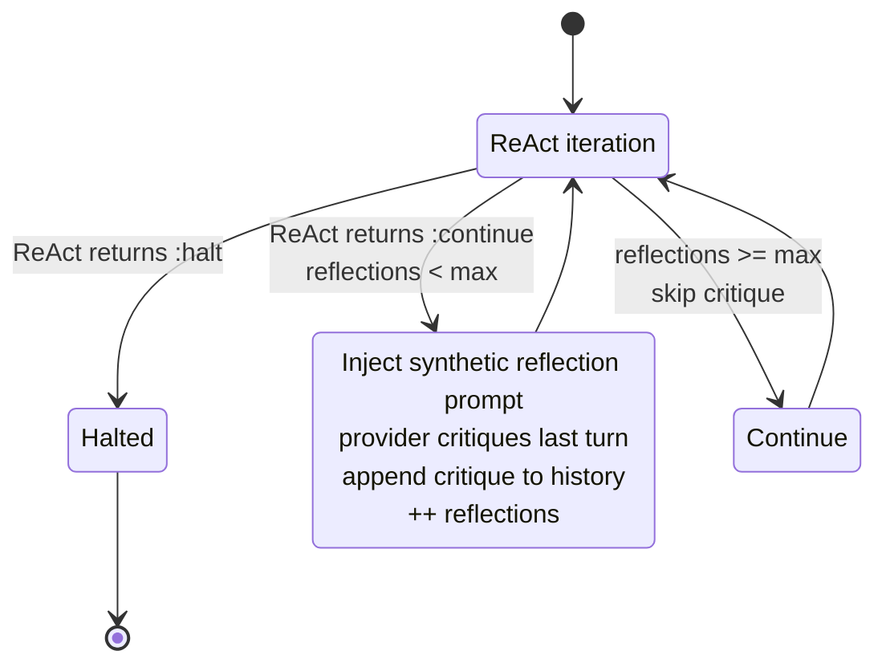

# 04 · Modes — Strategy

> **What this answers:** how do `:react`, `:plan_and_solve`, `:reflexion` differ at the per-turn level? How would I write a custom mode?
> **Audience:** consumers picking a mode; contributors writing one.

---

## The mode plug-in



The behaviour is tiny. See [`lib/ex_athena/loop/mode.ex`](../lib/ex_athena/loop/mode.ex). `iterate/1` returns one of three things and the kernel handles everything else (see [03 · Reasoning loop](03-reasoning-loop.md)).

```elixir
@callback init(State.t()) :: {:ok, State.t()} | {:error, term()}
@callback iterate(State.t()) ::
            {:continue, State.t()}        # keep looping
            | {:halt, State.t()}          # stop; finish_reason must be set
            | {:error, term()}            # abort; kernel wraps in :error_during_execution
                                          #   (special: :error_prompt_too_long → reactive compact)
@callback productivity_signal(State.t(), State.t()) :: boolean()  # optional
```

`atom → module` resolution lives in [`Mode.resolve/1`](../lib/ex_athena/loop/mode.ex#L68): `:react`, `:plan_and_solve`, `:reflexion` map to the built-in modules; anything else is used verbatim, so you can pass `MyApp.MyMode` directly.

---

## ReAct (default)



Reference implementation in [`lib/ex_athena/modes/react.ex`](../lib/ex_athena/modes/react.ex). Highlights:

- **Streaming-aware**: uses `Provider.stream/3` when `:on_event` is set on the loop, otherwise `query/2` ([`react.ex:78`](../lib/ex_athena/modes/react.ex#L78)).
- **ChatParams hook** fires before each provider call ([`react.ex:56`](../lib/ex_athena/modes/react.ex#L56)) so hooks can rewrite system prompt / temperature / tools per turn.
- **Parallel tool calls**: read-only tools batch via [`Loop.Parallel.run/3`](../lib/ex_athena/loop/parallel.ex); mutating tools (`parallel_safe?: false`) serialize. See [07 · Tools](07-tools.md).
- **Mistake-counter reset**: any successful tool execution in a turn resets `consecutive_mistakes` to 0 ([`react.ex:118`](../lib/ex_athena/modes/react.ex#L118)).
- **No tool calls = `:stop`**: model returned plain text → final turn.

Use ReAct when: you want the default. It's tuned to handle native and TextTagged tool calls, multiple providers, and parallel safety.

---

## Plan-and-Solve



Reference: [`lib/ex_athena/modes/plan_and_solve.ex`](../lib/ex_athena/modes/plan_and_solve.ex).

- **One forced planning turn** with no tools attached and a hardcoded planning addendum to the system prompt ([`plan_and_solve.ex:37`](../lib/ex_athena/modes/plan_and_solve.ex#L37)).
- Subsequent turns fall through to the ReAct cycle.
- `mode_state[:phase]` switches `:planning → :executing` after the first turn.

Use Plan-and-Solve when: small / weak models that tend to take an action before reasoning, or tasks where you'd like an explicit plan in the message history for downstream review.

Cross-link: [`guides/getting_started.md`](../guides/getting_started.md) covers wiring it up.

---

## Reflexion



Reference: [`lib/ex_athena/modes/reflexion.ex`](../lib/ex_athena/modes/reflexion.ex).

- Each ReAct turn is followed by a self-critique provider call (one extra inference per iteration).
- Hard-capped at **3 reflections** ([`@hard_cap`](../lib/ex_athena/modes/reflexion.ex#L40)) — beyond that, the research shows degeneration-of-thought.
- Configurable via `meta.max_reflections` (clamped to `@hard_cap`).
- Roughly **3× cost** of bare ReAct — reserve for correctness-critical tasks.

Use Reflexion when: structured extraction at the edge of a model's ability, fact-checking, or any flow where catching mistakes once costs less than a wrong final answer.

---

## Decision matrix

| Mode | Best for | Cost | Tools allowed turn 1? | Notes |
|---|---|---|---|---|
| `:react` | General coding agents, chat | 1× | Yes | Default. |
| `:plan_and_solve` | Small models, plan-visible workflows | 1× (turn 1 cheap — no tools) | **No** | Forces a planning turn. |
| `:reflexion` | Correctness-critical | ~3× | Yes | Hard cap of 3 reflections. |

You can also pass a module: `mode: MyApp.CustomMode`.

---

## Writing a custom mode

Minimum implementation:

```elixir
defmodule MyApp.CountingMode do
  @behaviour ExAthena.Loop.Mode

  alias ExAthena.Loop.State

  @impl true
  def init(%State{} = state), do: {:ok, %{state | mode_state: %{turns: 0}}}

  @impl true
  def iterate(%State{mode_state: %{turns: n}} = state) when n >= 5 do
    {:halt, ExAthena.Loop.set_finish_reason(state, :stop)}
  end

  def iterate(%State{} = state) do
    # … run inference, parse tool calls, etc. (delegate to ReAct primitives)
    new_state = put_in(state.mode_state[:turns], state.mode_state.turns + 1)
    {:continue, new_state}
  end
end
```

### What you get for free from the kernel

- Iteration / mistake / budget / no-progress caps
- Compaction (proactive + reactive)
- Session* / UserPromptSubmit / Stop / SessionEnd hooks
- Telemetry spans
- Result assembly

### What you must do yourself

- Call `Provider.query/2` or `Provider.stream/3` (via the state's `provider_mod` / `provider_opts`)
- Parse tool calls via `ExAthena.ToolCalls.extract/2`
- Gate tool calls via `ExAthena.Permissions.check/3`
- Fire `PreToolUse` / `PostToolUse` via `ExAthena.Hooks.run_*`
- Execute tools (use `ExAthena.Loop.Parallel.run/3` to handle parallel-safe batching)
- Append assistant + tool_result messages to `state.messages`
- Set `finish_reason: :stop` on halt: `ExAthena.Loop.set_finish_reason(state, :stop)` (private but stable — see [`loop.ex:356`](../lib/ex_athena/loop.ex#L356)). For non-`:stop` halts your mode should also set `finish_reason` to a member of `Loop.Terminations.all/0`.

The 200-line `ReAct` module is the reference — copy and modify.

---

## Contributor notes

- **`mode_state` is yours**: anything mode-specific (phase, counters, intermediate plans) goes there. The kernel doesn't touch it.
- **No tool-call termination**: convention is that `Modes.ReAct` sets `:stop` when `tool_calls == []`. Custom modes are free to halt on different signals (e.g. a plan was produced and you treat that as terminal).
- **Provider errors → `{:error, …}`**: let the kernel wrap them as `:error_during_execution`. The one exception is "prompt too long" — return `{:error, :error_prompt_too_long}` so the kernel can attempt reactive compaction.
- **Productivity signal is advisory**: if your mode's notion of "progress" differs (e.g. Reflexion considers a self-critique productive even with the same tool fingerprint), implement `productivity_signal/2` and the kernel will defer to you.
- **Hot-path discipline**: `iterate/1` runs in the caller's process. Heavy work (e.g. running a subagent) is fine but must complete before the next iteration starts. Async fan-out belongs in tools, not in the mode itself.
