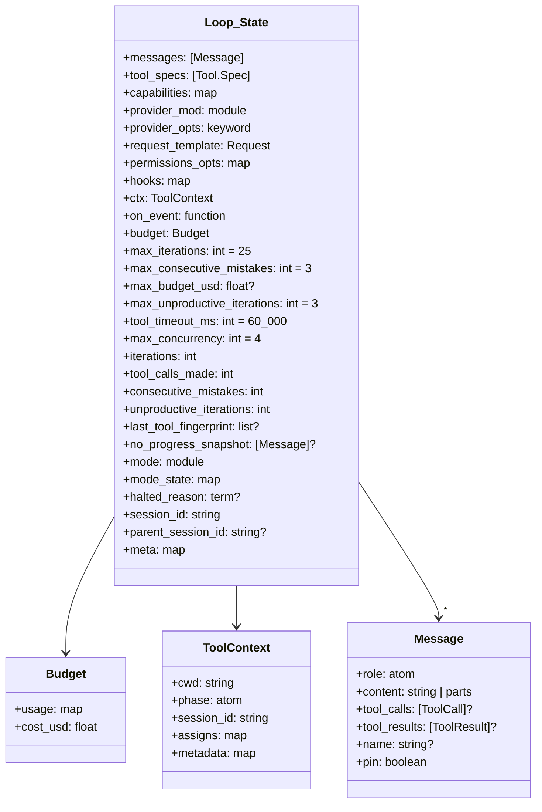
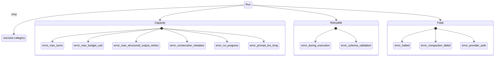
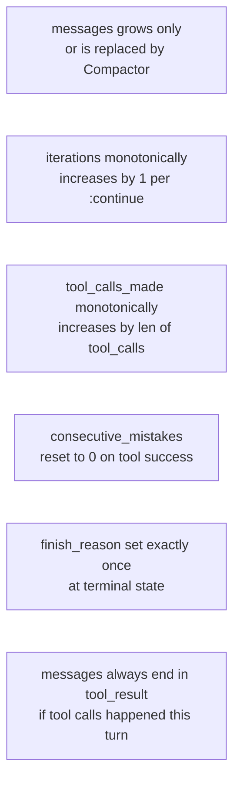
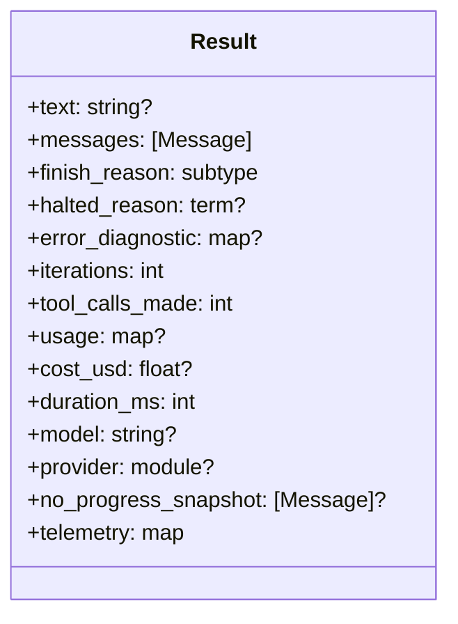

# 05 · State & Termination

> **What this answers:** what does `Loop.State` carry? What are the 12 finish reasons and how should they be classified?
> **Audience:** contributors (state invariants); consumers (interpreting `Result.finish_reason`).

---

## Loop.State at a glance



Source: [`lib/ex_athena/loop/state.ex`](../lib/ex_athena/loop/state.ex). State is *opaque* — only `Loop.Mode` implementations receive it. Consumers see `ExAthena.Result` ([`lib/ex_athena/result.ex`](../lib/ex_athena/result.ex)).

### Field roles

| Field | Role |
|---|---|
| `messages` | Running conversation. Grows each turn. Compacted between turns. |
| `tool_specs` | Resolved tool list — builtin + MCP. Stable across the run unless a `ChatParams` hook rewrites it. |
| `capabilities` | Provider capabilities (`max_tokens`, `native_tool_calls`, `streaming`, multimodal flags). Used by tool-call parser tier selection. |
| `provider_mod`, `provider_opts` | Where to call. |
| `request_template` | Base `Request` overlaid each iteration with current messages + tool schemas. |
| `permissions_opts` | `phase`, `allowed_tools`, `disallowed_tools`, `can_use_tool`. Fed to [`Permissions.check/3`](../lib/ex_athena/permissions.ex). |
| `hooks` | Lifecycle hook table. |
| `ctx` | `ToolContext` — cwd, phase, session_id, assigns. Threaded to every `Tool.execute/2`. |
| `on_event` | Optional stream-event callback. |
| `budget` | Accumulating token + cost usage. |
| `max_iterations` etc. | Kernel caps. |
| `iterations`, `tool_calls_made`, `consecutive_mistakes`, `unproductive_iterations` | Kernel counters. |
| `last_tool_fingerprint` | Sorted `[{name, json_args}]` from previous turn — drives no-progress detection. |
| `no_progress_snapshot` | Snapshot of stuck messages, attached to Result when `:error_no_progress` fires. |
| `mode`, `mode_state` | Strategy module + its private state. |
| `halted_reason` | Populated when a hook / tool returned `{:halt, r}`. |
| `session_id`, `parent_session_id` | Stable run identity + subagent linkage. |
| `meta` | Open extension point for compactor knobs (`auto_pin`, `reactive_compact`, `pinned_prefix_count`, …), mode keys, hook outputs (`early_halt`). |

---

## Twelve termination subtypes

Source: [`lib/ex_athena/loop/terminations.ex`](../lib/ex_athena/loop/terminations.ex).



### Category table

| Subtype | Category | When it fires | Where set |
|---|---|---|---|
| `:stop` | `:success` | Model returned text with no tool calls. | [`react.ex:98`](../lib/ex_athena/modes/react.ex#L98) |
| `:error_max_turns` | `:capacity` | `iterations >= max_iterations`. | [`loop.ex:125`](../lib/ex_athena/loop.ex#L125) |
| `:error_max_budget_usd` | `:capacity` | `Budget.exceeded?` for `max_budget_usd`. | [`loop.ex:133`](../lib/ex_athena/loop.ex#L133) |
| `:error_max_structured_output_retries` | `:capacity` | Structured extraction repair budget exhausted. | `Structured` |
| `:error_consecutive_mistakes` | `:capacity` | `consecutive_mistakes >= max`. | [`loop.ex:129`](../lib/ex_athena/loop.ex#L129) |
| `:error_no_progress` | `:capacity` | `unproductive_iterations >= max` with guard > 0. Carries `no_progress_snapshot`. | [`loop.ex:140`](../lib/ex_athena/loop.ex#L140) |
| `:error_prompt_too_long` | `:capacity` | Reactive compact failed or still too large. | [`loop.ex:190`](../lib/ex_athena/loop.ex#L190) |
| `:error_during_execution` | `:retryable` | Mode returned `{:error, reason}` not handled specially. | [`loop.ex:161`](../lib/ex_athena/loop.ex#L161) |
| `:error_schema_validation` | `:retryable` | Structured output failed schema; `error_diagnostic` carries detail. | `Structured` |
| `:error_halted` | `:fatal` | Hook or tool returned `{:halt, reason}`; `meta.early_halt` is set. | [`loop.ex:121`](../lib/ex_athena/loop.ex#L121) |
| `:error_compaction_failed` | `:fatal` | Compactor returned `{:error, _}`. | [`loop.ex:167`](../lib/ex_athena/loop.ex#L167) |
| `:error_provider_auth` | `:fatal` | Provider returned HTTP 401 / 403. | Provider adapter |

### Classification helpers

```elixir
ExAthena.Loop.Terminations.category(:stop)               # => :success
ExAthena.Loop.Terminations.category(:error_max_turns)    # => :capacity
ExAthena.Loop.Terminations.category(:error_halted)       # => :fatal
ExAthena.Loop.Terminations.success?(:stop)               # => true
ExAthena.Loop.Terminations.error?(:error_max_turns)      # => true
ExAthena.Loop.Terminations.all()                         # => [:stop, …]
```

See [17 · Error recovery](17-error-recovery.md) for the caller-side playbook for each category.

---

## State invariants



Concretely:

- `iterations` grows by 1 per `{:continue, _}` ([`loop.ex:150`](../lib/ex_athena/loop.ex#L150)).
- `tool_calls_made` grows by the number of tool calls in the turn ([`react.ex:115`](../lib/ex_athena/modes/react.ex#L115)).
- `consecutive_mistakes` is reset to 0 by `Modes.ReAct` on any successful tool execution ([`react.ex:118`](../lib/ex_athena/modes/react.ex#L118)).
- `finish_reason` lives in `meta` and is written via `Loop.set_finish_reason/2` ([`loop.ex:356`](../lib/ex_athena/loop.ex#L356)). Once set, the loop exits.
- `Loop.State` is a struct — every step returns a new copy. No in-place mutation.

---

## Result struct — public face of terminal state



Built in [`Loop.to_result/2`](../lib/ex_athena/loop.ex#L422). The text is the last assistant message's content ([`extract_final_text/1`](../lib/ex_athena/loop.ex#L479)).

`category/1` lives on the Result struct or you can call `Loop.Terminations.category(result.finish_reason)`.

---

## Contributor notes

- **State field churn**: each new field added to `State` must be defaulted in `defstruct` and noted in the `@type t :: %__MODULE__{…}` block. Tests load fresh state via `%State{}` so default values matter.
- **`meta` over new fields**: when in doubt, add a key to `meta` instead of growing the struct. Mode keys, compactor knobs, and hook outputs all live there.
- **Don't read `halted_reason` to detect "did this halt"**: `halted_reason` is just an optional explanation. The authoritative signal is `meta.finish_reason`, surfaced as `Result.finish_reason`.
- **Pinning**: `Message.pin = true` tells the compactor "never drop me." Set via `meta.auto_pin` or explicit pin in your message list. See [`apply_auto_pin/1`](../lib/ex_athena/loop.ex#L243).
- **Generated session id**: when `:session_id` isn't passed, the kernel generates a 16-byte URL-safe random string ([`generate_session_id/0`](../lib/ex_athena/loop.ex#L647)). Tests that need stability should pass one.

---

## Where to go next

- [17 · Error recovery](17-error-recovery.md) — what to do with each finish reason.
- [03 · Reasoning loop](03-reasoning-loop.md) — see the kernel write these fields.
- [12 · Compaction](12-compaction.md) — how `pin` and `meta.auto_pin` are honored.
