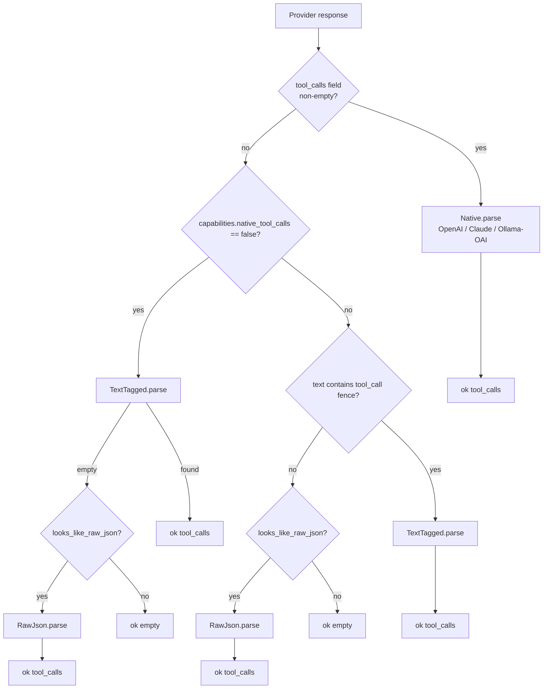
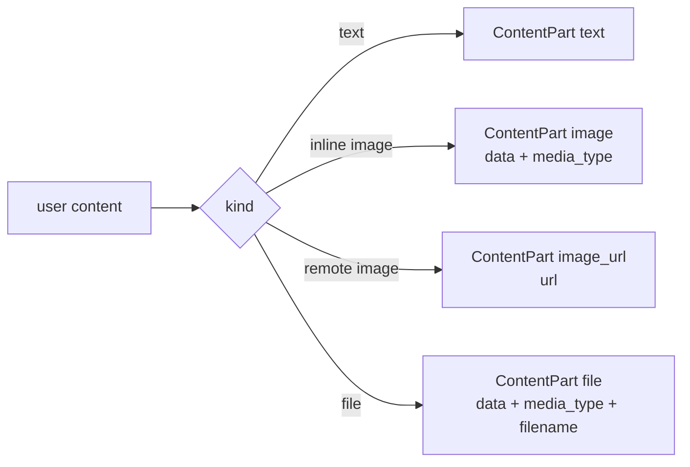

# 06 · Messages & Tool Calls

> **What this answers:** how is the conversation represented in memory? How does ExAthena turn a model's response into structured tool calls?
> **Audience:** consumers building tools / inspecting transcripts; contributors touching the parser tiers.

---

## Canonical conversation model

```mermaid
classDiagram
  class Message {
    +role: :system | :user | :assistant | :tool
    +content: string | [ContentPart] | nil
    +tool_calls: [ToolCall]?
    +tool_results: [ToolResult]?
    +name: string?
    +pin: boolean = false
  }

  class ToolCall {
    +id: string
    +name: string
    +arguments: map
  }

  class ToolResult {
    +tool_call_id: string
    +content: string
    +is_error: boolean?
    +ui_payload: %{kind, payload}?
  }

  class ContentPart {
    +type: :text | :image | :image_url | :file
    +text: string?
    +url: string?
    +data: binary?
    +media_type: string?
    +filename: string?
  }

  Message "1" --> "*" ToolCall: when role==assistant
  Message "1" --> "*" ToolResult: when role==tool
  Message --> "*" ContentPart: multimodal content
```

Source: [`lib/ex_athena/messages.ex`](../lib/ex_athena/messages.ex), [`lib/ex_athena/messages/content_part.ex`](../lib/ex_athena/messages/content_part.ex).

### Constructors

```elixir
ExAthena.Messages.user("Hi")
ExAthena.Messages.assistant("here you go", [%ToolCall{id: "1", name: "read", arguments: %{}}])
ExAthena.Messages.system("You are helpful.")
ExAthena.Messages.tool_result("1", "file contents", false, %{kind: :file, payload: %{…}})
```

`from_map/1` ([`messages.ex:107`](../lib/ex_athena/messages.ex#L107)) tolerates both atom and string keys so provider JSON and user-built data both deserialize cleanly.

### Why `ToolResult` has both `content` and `ui_payload`

- `content` — what the LLM sees on the next turn.
- `ui_payload` — what the host UI (TUI / LiveView) renders as rich content (diffs, file previews, command output).

`ui_payload` is `nil` for tools that emit text only.

---

## How tool calls get parsed



Source: [`ExAthena.ToolCalls.extract/2`](../lib/ex_athena/tool_calls.ex#L48).

The kernel picks the right parser tier based on:

1. **Did the provider hand us a structured `tool_calls` array?** → `Native.parse/1`. This is the happy path for OpenAI, Anthropic, and Ollama's OAI-compatible endpoint.
2. **Otherwise, does the model emit a `~~~tool_call <json> ~~~` fence?** → `TextTagged.parse/1`. ExAthena augments the system prompt with TextTagged instructions ([`augment_system_prompt/3`](../lib/ex_athena/tool_calls.ex#L91)) when `capabilities.native_tool_calls == false`.
3. **Otherwise, does the text contain `"name"` and `"arguments"` substrings?** → `RawJson.parse/1`. Backstop for weak open-weight models that ignore both protocols and just emit bare JSON.
4. **Otherwise** → `{:ok, []}`.

### Three parsers

| Module | Input shape | When used |
|---|---|---|
| [`ToolCalls.Native`](../lib/ex_athena/tool_calls/native.ex) | `[%{id, function: %{name, arguments}}]` or Claude tool_use blocks | Provider declares native tool-call support and produces them. |
| [`ToolCalls.TextTagged`](../lib/ex_athena/tool_calls/text_tagged.ex) | `~~~tool_call\n{"name":..., "arguments":...}\n~~~` | Provider doesn't natively support tool calls, or fenced output detected. |
| [`ToolCalls.RawJson`](../lib/ex_athena/tool_calls/raw_json.ex) | bare or fenced `{"name":..., "arguments":...}` | Weak models that ignore both protocols. |

All three return `{:ok, [%ExAthena.Messages.ToolCall{}]}` — the parser tier is invisible above.

Cross-link: [`guides/tool_calls.md`](../guides/tool_calls.md) — protocol details and prompt-augmentation strategy.

---

## Multimodal content parts



Each provider normalises these into its native wire format. Use `ExAthena.supports_multimodal?/0` to gate UI behaviour (it always returns `true` today; the function exists so callers don't have to encode capability assumptions).

Cross-link: [`guides/multimodal.md`](../guides/multimodal.md) — provider-by-provider examples.

---

## TextTagged prompt augmentation

When a provider lacks native tool calls, ExAthena appends a tools catalog + format instructions to the system prompt at request time:

```text
You have access to the following tools. When you want to call a tool,
respond with a fenced block using this exact shape — no other format is
accepted:

    ~~~tool_call
    {"name": "<tool>", "arguments": {"arg1": "...", "arg2": "..."}}
    ~~~

Emit one ~~~tool_call block per call. Multiple blocks in a single
response are allowed. When you are done using tools, respond with plain
text only (no fences) and the runtime will stop.

Available tools:

- `read` — Read a file from disk
  Schema: {"type":"object","properties":{"file_path":{"type":"string"}},"required":["file_path"]}
- …
```

The `:compact` option emits one-line signatures instead of full JSON schemas (useful for small models that degrade past ~4 KB system prompts). See [`augment_system_prompt/3`](../lib/ex_athena/tool_calls.ex#L91), [`format_tool_list_compact/1`](../lib/ex_athena/tool_calls.ex#L139).

---

## Contributor notes

- **Always a list, never `nil`**: `ToolCalls.extract/2` returns `{:ok, []}` rather than `{:ok, nil}` so caller pattern-matching is uniform.
- **`id` is the join key**: `Message.tool_calls[*].id` must match the next `Message.tool_results[*].tool_call_id`. Compaction respects this when pinning (see [`apply_auto_pin/1`](../lib/ex_athena/loop.ex#L243)) — it pins both the assistant message and the matching tool_result message so Summary doesn't orphan one.
- **`pin: true` on a message** marks it as "never drop me" for the Compactor. Pin sparingly; over-pinning defeats the purpose of compaction.
- **`is_error: true`** on a `ToolResult` is a signal for both the model (the result text usually starts with "Error: …") and any UI rendering — distinct from the loop counter, which is `consecutive_mistakes`.
- **Order matters**: the assistant message announcing tool calls must precede the tool-result messages in `state.messages`. Providers reject otherwise.
- **No mutation**: `Messages.user/1`, `assistant/2`, etc. build fresh structs. Don't mutate `state.messages` in place — let the Mode return a new state.

---

## Where to go next

- [07 · Tools](07-tools.md) — how tool calls execute once parsed.
- [10 · Providers](10-providers.md) — how each provider normalises its wire format into `Message` / `ToolCall`.
- [`guides/tool_calls.md`](../guides/tool_calls.md), [`guides/multimodal.md`](../guides/multimodal.md) — feature how-tos.
