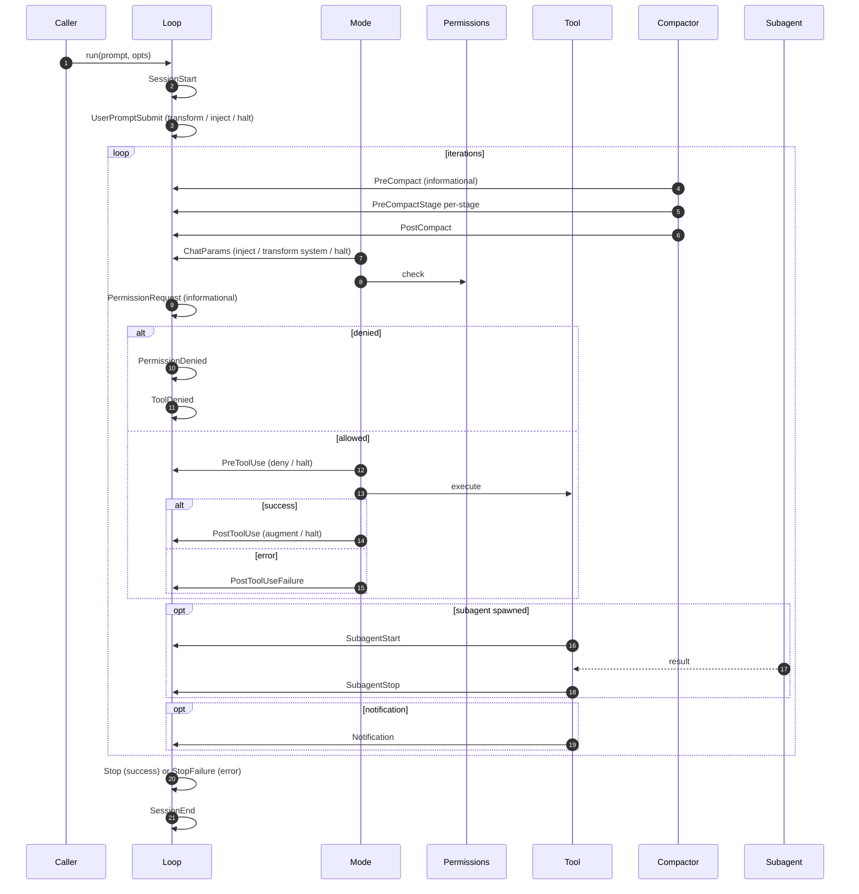

# 09 · Hooks — Lifecycle Events

> **What this answers:** when does each event fire? What can a hook do? How do `:inject` / `:transform` / `:deny` / `:halt` / `:augment` differ?
> **Audience:** consumers building hook tables; contributors maintaining lifecycle invariants.

---

## Where the 18 events fire in a turn



Source: [`ExAthena.Hooks`](../lib/ex_athena/hooks.ex). The 18 events live in [`Hooks.events/0`](../lib/ex_athena/hooks.ex#L64).

---

## Event catalog

| Event | Where | Payload includes | Return values honored |
|---|---|---|---|
| `:SessionStart` | Loop init | `session_id`, `parent_session_id` | `:halt` |
| `:SessionEnd` | After Stop/StopFailure | `session_id`, `parent_session_id`, `finish_reason`, `result` | (informational) |
| `:UserPromptSubmit` | Once, before first iteration | `prompt`, `session_id`, `parent_session_id` | `:inject` (append messages), `:transform` (rewrite prompt), `:halt` |
| `:ChatParams` | Each turn, just before provider call | `request` | `:inject` (append messages), `:transform` (rewrite system prompt), `:halt` |
| `:PreCompact` | Before compaction triggers | `estimate` | `:halt` |
| `:PreCompactStage` | Before each pipeline stage | `stage`, `estimate` | (informational) |
| `:PostCompact` | After successful compaction | `metadata` (before/after tokens, dropped count) | (informational) |
| `:PreToolUse` | Per tool call, before execute | `tool_name`, `args`, `tool_use_id` | `:deny` (synth deny tool_result), `:halt` |
| `:PostToolUse` | Per tool call, after success | `tool_name`, `result`, `tool_use_id` | `:augment text` (joined with `\n`), `:halt` |
| `:PostToolUseFailure` | Per tool call, on error | `tool_name`, `error`, `tool_use_id` | `:halt` |
| `:PermissionRequest` | Permissions.check called | `tool_name`, `args` | (informational) |
| `:PermissionDenied` | Permissions returned `{:deny, _}` | `denial` | (informational) |
| `:ToolDenied` | Tool ultimately blocked (deny path resolved) | `denial`, `tool_call_id` | (informational) |
| `:SubagentStart` | SpawnAgent tool spins up child | `agent_name`, `session_id`, `parent_session_id` | (informational) |
| `:SubagentStop` | Subagent loop terminated | `result`, `session_id`, `parent_session_id` | (informational) |
| `:Stop` | Successful termination (`:stop`) | `result`, `finish_reason` | (informational) |
| `:StopFailure` | Error termination | `result`, `finish_reason` | (informational) |
| `:Notification` | Tool emits a notification (e.g. status updates) | tool-defined | (informational) |

(Adjustments on `:transform` / `:inject` only apply on events that explicitly accept them — `UserPromptSubmit` for both, `ChatParams` for both, `PostToolUse` for `:augment`. Other events ignore them.)

---

## Hook shape

```elixir
hooks = %{
  # Per-tool hooks: regex matcher on tool_name; nil/missing matcher fires for all.
  PreToolUse: [
    %{matcher: "Write|Edit", hooks: [&deny_protected_paths/2]}
  ],
  PostToolUse: [
    %{matcher: "Bash", hooks: [&capture_test_output/2]}
  ],

  # Lifecycle hooks: bare function list, no matcher map.
  Stop: [&log_stop/2],
  SessionEnd: [&persist_transcript/2],

  UserPromptSubmit: [&inject_org_context/2]
}
```

Each hook callback receives `(input_map, tool_use_id_or_session_id)` and returns one of:

| Return | Effect | Valid in |
|---|---|---|
| `:ok` | Continue. | All |
| `{:deny, reason}` | Block the tool call (or `UserPromptSubmit`). | `PreToolUse`, `UserPromptSubmit`, `ChatParams` |
| `{:halt, reason}` | Stop the loop immediately. | All |
| `{:inject, msg \| [msg]}` | Append message(s) to conversation. | `UserPromptSubmit`, `ChatParams` |
| `{:transform, prompt}` | Replace the user-prompt content (UPS) or system prompt (ChatParams). Last-write-wins. | `UserPromptSubmit`, `ChatParams` |
| `{:augment, text}` | Append text to tool_result content visible to the model. Multiple augments joined with `\n`. | `PostToolUse` |

Hooks that crash become `{:halt, {:hook_crashed, message}}` via [`safe_call/3`](../lib/ex_athena/hooks.ex#L224). A hook crash kills the run — fix the hook, don't try/rescue around your own code.

Source: [`Hooks.run_lifecycle_with_outputs/3`](../lib/ex_athena/hooks.ex#L141).

---

## Matcher syntax

```elixir
# Regex string — compiled with Regex.compile!/1
%{matcher: "Write|Edit", hooks: [...]}

# Compiled Regex
%{matcher: ~r/^bash$/, hooks: [...]}

# nil or missing — matches every tool
%{matcher: nil, hooks: [...]}
%{hooks: [...]}
```

Implementation: [`Hooks.matches?/2`](../lib/ex_athena/hooks.ex#L217). Regex matching is run on the *raw tool name* (e.g. `"bash"`, `"web_fetch"`).

---

## Execution model

```mermaid
flowchart LR
  fire[run_lifecycle_with_outputs] --> seq[For each callback in order]
  seq --> call[safe_call]
  call --> r{return?}
  r -- :ok --> next[Next callback]
  r -- {:halt,r} --> stop[Halt — short-circuit]
  r -- {:inject, msg} --> accum[Append to injects acc]
  r -- {:inject, list} --> accum
  r -- {:transform, p} --> set[transform = p — last-write-wins]
  accum --> next
  set --> next
  next --> seq
  seq --> done[Return %{halt, injects, transform}]
```

- **Ordering**: callbacks run in the order listed in the hook table.
- **Halt is decisive**: the first `:halt` short-circuits the remaining callbacks for that event.
- **Injects accumulate**: multiple `:inject` returns from the same event all append (in order).
- **Transforms are last-write-wins**: only the final `:transform` value is kept.
- **Augments join**: in `PostToolUse`, multiple `:augment` returns are joined with `\n`. `:halt` still wins.

---

## Worked examples

### Inject org-wide context on every run

```elixir
defp inject_org_context(_payload, _session_id) do
  {:inject, ExAthena.Messages.system("Org policy: never paste secrets.")}
end

hooks = %{UserPromptSubmit: [&inject_org_context/2]}
```

### Transform user prompts (e.g. PII redaction)

```elixir
defp redact(payload, _session_id) do
  {:transform, scrub_emails(payload[:prompt])}
end

hooks = %{UserPromptSubmit: [&redact/2]}
```

### Block writes to a protected dir

```elixir
defp deny_protected_paths(%{args: %{"file_path" => p}}, _id) do
  if String.starts_with?(p, "/etc/"), do: {:deny, "writes to /etc forbidden"}, else: :ok
end

hooks = %{PreToolUse: [%{matcher: "Write|Edit", hooks: [&deny_protected_paths/2]}]}
```

### Augment tool results with context

```elixir
defp annotate_bash(%{result: r}, _id) do
  if String.contains?(r, "FAIL"), do: {:augment, "(tests failed — investigate before continuing)"}, else: :ok
end

hooks = %{PostToolUse: [%{matcher: "Bash", hooks: [&annotate_bash/2]}]}
```

### Persist transcripts on session end

```elixir
defp persist(%{result: r, session_id: sid}, _), do: Repo.insert(%Transcript{session_id: sid, body: r.messages})

hooks = %{SessionEnd: [&persist/2]}
```

---

## Contributor notes

- **`run_lifecycle/3` vs `run_lifecycle_with_outputs/3`**: legacy callers use the former (`:ok | {:halt, _}` only); anything needing `:inject` / `:transform` returns must use `run_lifecycle_with_outputs/3` and consume the structured outputs map.
- **`PostToolUse` vs `PostToolUseFailure`**: success path fires `PostToolUse` with the result; error path fires `PostToolUseFailure` with the error. They're separate so hooks can be matched independently.
- **No new events without a Result field**: if you add an event that emits structured data downstream (`SessionEnd.result.…`), surface it in `Result` (or `meta`) so consumers don't have to subscribe to hooks just to observe outcome.
- **Hook ordering inside a turn is fixed**: `PreCompact* → ChatParams → Permissions* → PreToolUse → execute → PostToolUse[Failure]`. Don't reorder; integrations rely on it.
- **Implicit diagnostics**: when LSP support is configured, [`ImplicitDiagnostics.maybe_merge/1`](../lib/ex_athena/lsp/implicit_diagnostics.ex) auto-adds a `PostToolUse` hook for `Write|Edit|ApplyPatch` that runs the LSP and augments results with diagnostics. See [15 · MCP & LSP](15-mcp-and-lsp.md).

---

## Where to go next

- [`guides/hooks_reference.md`](../guides/hooks_reference.md) — exhaustive catalog with payload field detail.
- [08 · Permissions](08-permissions.md) — how `PermissionRequest` / `PermissionDenied` / `ToolDenied` interact with the gate.
- [13 · Agents & subagents](13-agents-and-subagents.md) — `SubagentStart` / `SubagentStop` for nested loops.
