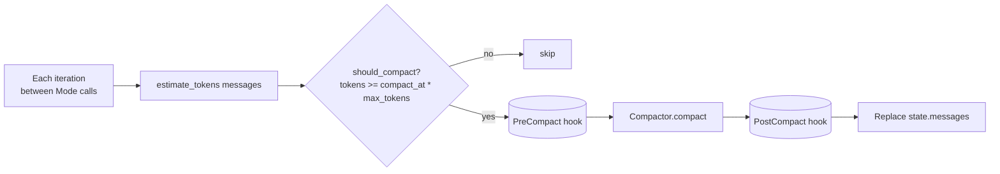
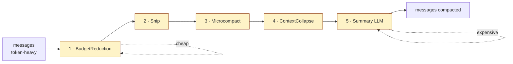
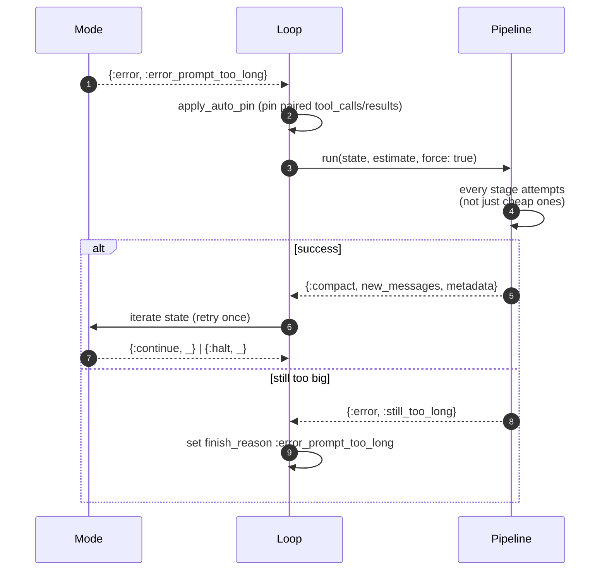
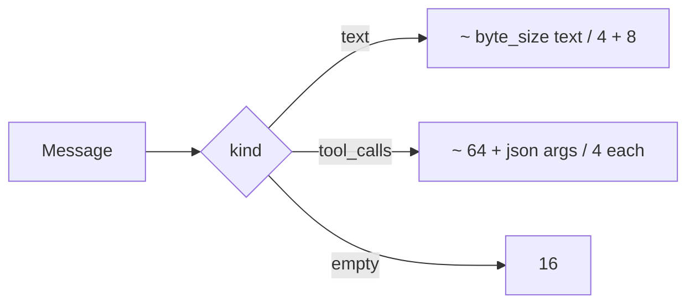

# 12 · Compaction — Keeping the Context Window Sane

> **What this answers:** when does ExAthena compact? What do the five stages do? How does reactive recovery work?
> **Audience:** consumers tuning long-running sessions; contributors writing custom stages.

---

## When and why

The Claude Code paper found that **proactive compaction at ~60% of the context limit beats reactive truncation at 95%**: the model never notices a sudden loss of continuity, and pinned rules survive every cycle.

Source: [`ExAthena.Compactor`](../lib/ex_athena/compactor.ex), [`Compactor.Pipeline`](../lib/ex_athena/compactor/pipeline.ex).



Default trigger: `compact_at = 0.6` (60% of `capabilities.max_tokens`). Override via `meta.compact_at` or `Loop.run` opts.

---

## The five-stage pipeline



Stages run in order, cheapest first. Each stage decides whether *it* can satisfy the budget; if so, the pipeline stops. The LLM-driven `Summary` stage runs only when the deterministic stages couldn't shrink the conversation enough.

Source: [`Compactor.Stage`](../lib/ex_athena/compactor/stage.ex) (behaviour) + [`Compactors.{BudgetReduction,Snip,Microcompact,ContextCollapse,Summary}`](../lib/ex_athena/compactors).

| Stage | Strategy | Cost |
|---|---|---|
| **BudgetReduction** | Drop tool-result `ui_payload` (not seen by LLM anyway); shrink long string content via tail-keep. | Free |
| **Snip** | Remove large interior message chunks (oldest middle messages) while keeping pinned prefix + live suffix. | Free |
| **Microcompact** | Collapse adjacent tool calls/results that are clearly subsumed by later state. | Free |
| **ContextCollapse** | Aggregate older message clusters into a single placeholder describing "what happened" without verbatim content. | Free |
| **Summary** | Call the session's own provider to produce a terse summary message that replaces the middle of history. | 1 inference |

Pinned prefix (`pinned_prefix_count`) — typically system prompt + memory + skills — is never dropped. Live suffix (`live_suffix_count`) — last few messages — is never dropped.

Cross-link: [`guides/compaction_pipeline.md`](../guides/compaction_pipeline.md) — exact behaviour of each stage.

---

## Reactive recovery

When a Mode tries to call the provider with too-large a prompt, it returns `{:error, :error_prompt_too_long}`. The kernel responds:



One-shot retry. If the second iteration also fails, the loop terminates with `:error_prompt_too_long` (category `:capacity`).

Source: [`Loop.handle_prompt_too_long/1`](../lib/ex_athena/loop.ex#L177), [`Loop.force_compact/1`](../lib/ex_athena/loop.ex#L203).

Disable reactive recovery with `reactive_compact: false` in Loop opts ([`Loop.reactive_compact_opts/1`](../lib/ex_athena/loop.ex#L293)).

---

## Auto-pin: protecting tool-call/result pairs

Summary-style compaction can drop the assistant message that announced a tool call but keep its tool_result — orphaning the result. To prevent this, the kernel reads `meta.auto_pin.tool_names` ([`apply_auto_pin/1`](../lib/ex_athena/loop.ex#L243)) and pins *both* messages of any pair whose tool name matches.

```elixir
ExAthena.run(prompt,
  auto_pin: %{tool_names: ["plan_mode", "todo_write"]}
)
```

Use this for tools whose output influences the model's later behaviour (plans, todos) — losing the announcement would make the result feel orphaned.

---

## Estimator



Source: [`Compactor.estimate_tokens/1`](../lib/ex_athena/compactor.ex#L75). This is *good enough for triggering compaction*, not a billing-grade count. Billing uses `Response.usage` returned by the provider.

---

## Custom stages

```elixir
defmodule MyApp.DropImages do
  @behaviour ExAthena.Compactor.Stage

  @impl true
  def name, do: :drop_images

  @impl true
  def attempt(state, _estimate, _opts) do
    new = Enum.map(state.messages, &strip_images/1)
    {:ok, new, %{reason: :images_stripped, dropped_count: 0}}
  end
end

# Use it
ExAthena.run(prompt,
  compactor: ExAthena.Compactor.Pipeline,
  compaction_pipeline: [
    ExAthena.Compactors.BudgetReduction,
    MyApp.DropImages,
    ExAthena.Compactors.Snip,
    ExAthena.Compactors.Summary
  ]
)
```

Or replace the compactor entirely:

```elixir
ExAthena.run(prompt, compactor: MyApp.MyCompactor)
```

---

## Telemetry

```text
:telemetry events
  [:ex_athena, :compaction, :stop]
    measurements: %{before_tokens, after_tokens, dropped_count}
    metadata: %{reason}
```

Use these for dashboards that show "how much context did we save."

---

## Contributor notes

- **Stage purity**: stages must be deterministic and side-effect-free (except `Summary`, which makes one LLM call). Don't mutate filesystem or external state in a stage.
- **Pinned prefix + live suffix invariants**: every stage MUST preserve `state.messages` ranges marked with `pin: true`, the first N messages where N = `meta.pinned_prefix_count`, and the last K where K = `meta.live_suffix_count`. Tests assert this.
- **Don't break tool_call/tool_result pairs**: the auto-pin mechanism is the safety net, but stages should still try not to drop one half of a pair unless they also drop the other.
- **Token estimate vs reality**: the estimator is approximate. If a provider's tokenizer is wildly different (e.g. multilingual), augment `compact_at` to be more conservative rather than rewriting the estimator.
- **Summary stage uses session provider**: it calls the same LLM. Cost is real and shows up in `Result.cost_usd`. Don't use Summary on the cost-sensitive providers without measuring.
- **`force: true` bypasses `should_compact?`**: reactive recovery always wants to try every stage. Don't add stages that gate themselves further inside `attempt/3` based on token count.

---

## Where to go next

- [`guides/compaction_pipeline.md`](../guides/compaction_pipeline.md) — detailed stage behaviour.
- [05 · State & termination](05-state-and-termination.md) — `:error_prompt_too_long` and `:error_compaction_failed` finish reasons.
- [03 · Reasoning loop](03-reasoning-loop.md) — where the kernel calls compaction.
