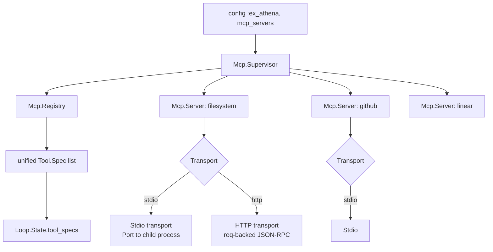
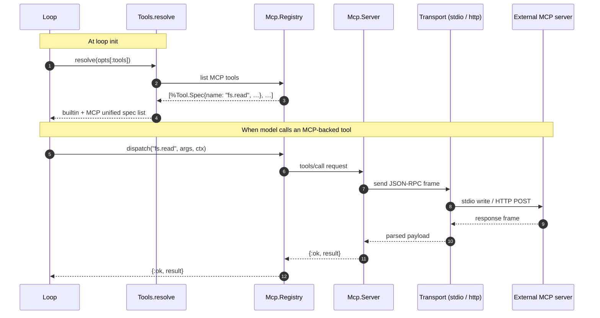
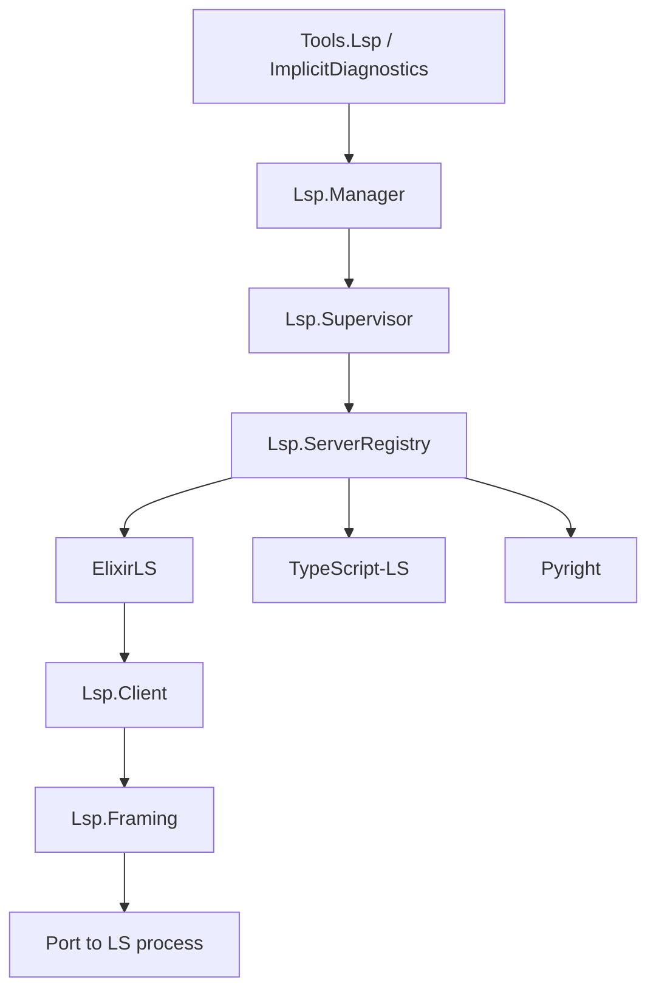
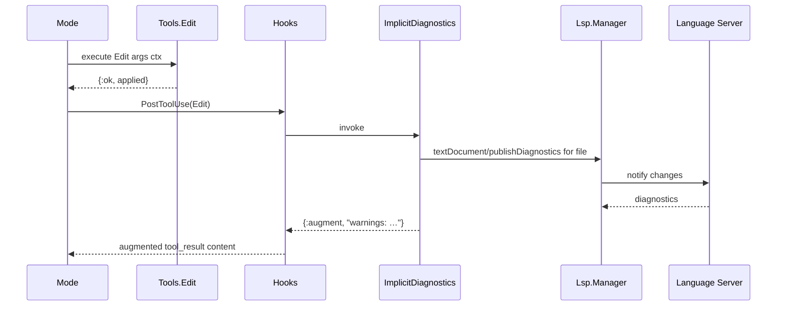

# 15 · MCP & LSP — External Integrations

> **What this answers:** how do MCP servers and language servers plug in? When do they fire?
> **Audience:** consumers wiring up external tooling; contributors maintaining transports.

---

## MCP (Model Context Protocol)



Sources:
- Public façade: [`ExAthena.Mcp`](../lib/ex_athena/mcp.ex)
- Supervisor: [`Mcp.Supervisor`](../lib/ex_athena/mcp/supervisor.ex)
- Server: [`Mcp.Server`](../lib/ex_athena/mcp/server.ex)
- Registry: [`Mcp.Registry`](../lib/ex_athena/mcp/registry.ex)
- Transport: [`Mcp.Transport`](../lib/ex_athena/mcp/transport.ex), [`Mcp.Transport.*`](../lib/ex_athena/mcp/transport)
- Protocol: [`Mcp.Protocol`](../lib/ex_athena/mcp/protocol.ex)
- Bridge to Tool behaviour: [`Mcp.Tool`](../lib/ex_athena/mcp/tool.ex)

### MCP lifecycle per turn



### Configuration

```elixir
# config/config.exs
config :ex_athena, :mcp_servers, [
  %{
    name: :filesystem,
    transport: :stdio,
    command: ["mcp-server-filesystem"],
    env: %{}
  },
  %{
    name: :github,
    transport: :http,
    base_url: "http://localhost:7000",
    auth: {:bearer, System.fetch_env!("GH_TOKEN")}
  }
]
```

Each server's tools become available under a namespaced name (`<server_name>.<tool_name>`) so they don't collide with builtins.

### Transports

| Transport | Use when | Frame format |
|---|---|---|
| `stdio` | Child process MCP server (most npm/python MCP servers). | Line-delimited JSON-RPC ([`Mcp.Framing`](../lib/ex_athena/lsp/framing.ex) shared with LSP) |
| `http` | Remote MCP server reachable over network. | HTTP POST with JSON body |

Cross-link: see `adr/` for MCP transport design decisions.

---

## LSP (Language Server Protocol)



Sources:
- Public façade: [`ExAthena.Lsp`](../lib/ex_athena/lsp.ex)
- Manager + Supervisor: [`Lsp.Manager`](../lib/ex_athena/lsp/manager.ex), [`Lsp.Supervisor`](../lib/ex_athena/lsp/supervisor.ex)
- Server registry: [`Lsp.ServerRegistry`](../lib/ex_athena/lsp/server_registry.ex)
- Client: [`Lsp.Client`](../lib/ex_athena/lsp/client.ex)
- Framing: [`Lsp.Framing`](../lib/ex_athena/lsp/framing.ex)
- Implicit diagnostics hook: [`Lsp.ImplicitDiagnostics`](../lib/ex_athena/lsp/implicit_diagnostics.ex)

### Two integration points

#### 1. Explicit — `Tools.Lsp`

The `lsp` tool exposes LSP queries to the model:

```text
lsp(action: "definition", file: "lib/foo.ex", line: 42, col: 10)
lsp(action: "references", file: "lib/foo.ex", line: 42, col: 10)
lsp(action: "diagnostics", file: "lib/foo.ex")
```

Source: [`Tools.Lsp`](../lib/ex_athena/tools/lsp.ex). The model uses this when it explicitly wants symbol resolution.

#### 2. Implicit — `ImplicitDiagnostics`

After every `write` / `edit` / `apply_patch`, the kernel auto-adds a `PostToolUse` hook that:

1. Runs the LSP against the touched file.
2. Collects diagnostics.
3. Returns `{:augment, "Diagnostics: …"}` so the model sees them on the next turn.



Source: [`ImplicitDiagnostics.maybe_merge/1`](../lib/ex_athena/lsp/implicit_diagnostics.ex). Wired in [`Loop.build_initial_state/2`](../lib/ex_athena/loop.ex#L573).

### Configuration

```elixir
config :ex_athena, :lsp,
  servers: %{
    elixir: %{command: ["elixir-ls"], extensions: [".ex", ".exs"]},
    typescript: %{command: ["typescript-language-server", "--stdio"], extensions: [".ts", ".tsx"]}
  },
  implicit_diagnostics: true
```

To disable implicit diagnostics: `implicit_diagnostics: false`.

---

## MCP + LSP comparison

| | MCP | LSP |
|---|---|---|
| Purpose | Domain-specific tools (filesystem, GitHub, Linear, …) | Language semantics (definitions, references, diagnostics) |
| Direction | Model → external service | Build feedback → model |
| Visible to model | As tools (`<server>.<tool>`) | As `lsp` tool + augmented tool_result diagnostics |
| Transport | stdio / HTTP JSON-RPC | stdio JSON-RPC |
| Lifecycle | Long-lived per session (one process per server) | Long-lived per language family |
| Init time | At Loop.run start | At first Edit / Write / Lsp tool use |

Both wire into the same Tool spec system, so the Mode + permissions + hooks don't care which is which.

---

## Contributor notes

- **MCP framing reuse**: stdio framing is shared between MCP and LSP ([`Lsp.Framing`](../lib/ex_athena/lsp/framing.ex)). Don't duplicate — extend the existing module if you need a new variant.
- **Tool name namespacing**: MCP tools get prefixed with the server name to avoid collision. Don't strip the prefix in error messages — users need to know which server produced the result.
- **LSP is best-effort**: implicit diagnostics fail silently (no diagnostics produced → no augment text). Don't gate the loop on diagnostics availability.
- **Server crashes**: both MCP and LSP supervisors restart child processes. If a server crashes mid-call, the in-flight request returns `{:error, …}` and the model gets to retry or pivot.
- **Don't hand-roll JSON-RPC**: use the existing [`Mcp.Protocol`](../lib/ex_athena/mcp/protocol.ex) helpers. They handle frame ids, error codes, and notification vs request distinction.

---

## Where to go next

- [07 · Tools](07-tools.md) — the unified tool spec system MCP plugs into.
- [09 · Hooks](09-hooks.md) — `PostToolUse` augmentation pattern, used by ImplicitDiagnostics.
