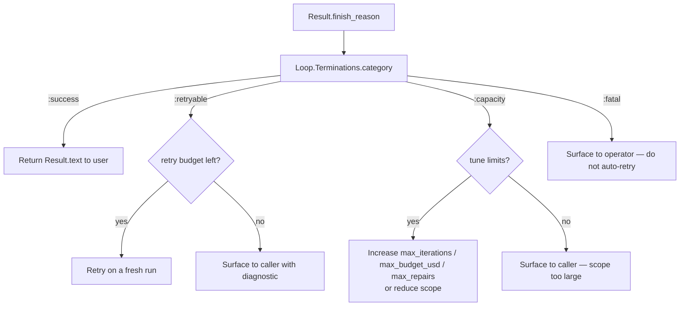
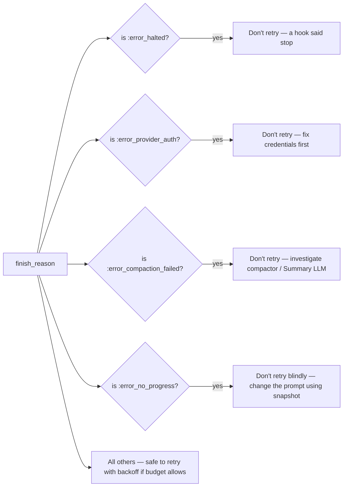

# 17 · Error Recovery — Caller Playbook

> **What this answers:** what does each `Result.finish_reason` mean, and what should the caller do?
> **Audience:** consumers wrapping `Loop.run` / `Session.send_message` with retry / surface / abort logic.

---

## The decision tree



Code: `Loop.Terminations.category(result.finish_reason)`. Source: [`lib/ex_athena/loop/terminations.ex`](../lib/ex_athena/loop/terminations.ex#L90).

---

## Per-reason playbook

| `finish_reason` | Category | What it means | Recommended caller action |
|---|---|---|---|
| `:stop` | `:success` | Model returned text with no tool calls. | Use `Result.text`. Done. |
| `:error_max_turns` | `:capacity` | Iteration cap reached. | Either bump `max_iterations` (if you trust the task is genuinely large) **or** split the prompt **or** add a reminder hook that nudges the model to wrap up sooner. |
| `:error_max_budget_usd` | `:capacity` | Cost ceiling tripped. | Raise `max_budget_usd` if intentional; otherwise treat as "too expensive" and decline. Inspect `Result.cost_usd`. |
| `:error_max_structured_output_retries` | `:capacity` | Repair budget exhausted on structured extraction. | Simplify the schema, raise `max_repairs`, or upgrade the model. Inspect `Result.error_diagnostic`. |
| `:error_consecutive_mistakes` | `:capacity` | Mistake counter threshold hit (3 consecutive errors by default). | Surface — the model is stuck. The repeated `is_error: true` tool_results are in `Result.messages`; inspect for remediation. Consider a different mode (Plan-and-Solve) on retry. |
| `:error_no_progress` | `:capacity` | Loop detected identical tool fingerprint + no new assistant text across N iterations. | Take `Result.no_progress_snapshot`, summarise the stuck state, prompt the user for next step. Don't blindly retry — you'll loop again. |
| `:error_prompt_too_long` | `:capacity` | Reactive compaction failed or still produced too-large a prompt. | Caller can: (a) start a fresh session, (b) raise `:max_tokens` capability if the underlying model supports more, (c) trim the input messages manually. Compaction already tried its best. |
| `:error_during_execution` | `:retryable` | Mode returned an unrecoverable `{:error, reason}` — usually a provider HTTP error. | Retry on a fresh run with exponential backoff. Inspect `Result.halted_reason`. |
| `:error_schema_validation` | `:retryable` | Structured output didn't parse / didn't validate. | Retry once with a stricter system prompt. Inspect `Result.error_diagnostic`. |
| `:error_halted` | `:fatal` | A hook or tool returned `{:halt, reason}`. | Surface `Result.halted_reason` to caller. Don't auto-retry — something asked the loop to stop. |
| `:error_compaction_failed` | `:fatal` | The compactor itself errored (typically inside the Summary stage's LLM call). | Surface. Could indicate a downstream provider issue. Operator action. |
| `:error_provider_auth` | `:fatal` | Provider returned HTTP 401 or 403. | Operator must fix credentials — retry will fail identically. |

---

## Wrap pattern

A common recipe:

```elixir
def run_with_retry(prompt, opts, retries \\ 0) do
  case ExAthena.run(prompt, opts) do
    {:ok, %Result{finish_reason: :stop} = result} ->
      {:ok, result}

    {:ok, %Result{finish_reason: reason} = result} ->
      case Loop.Terminations.category(reason) do
        :retryable when retries < 2 ->
          Process.sleep(backoff(retries))
          run_with_retry(prompt, opts, retries + 1)

        :retryable ->
          {:error, {:gave_up, result}}

        :capacity ->
          {:error, {:capacity, result}}

        :fatal ->
          {:error, {:fatal, result}}

        :success ->
          {:ok, result}
      end

    {:error, _} = err ->
      err
  end
end
```

---

## When the snapshot helps

For `:error_no_progress` specifically, `Result.no_progress_snapshot` carries the last few messages that the loop was looping on. A good remediation prompt:

```elixir
case ExAthena.run(prompt, …) do
  {:ok, %Result{finish_reason: :error_no_progress, no_progress_snapshot: snap}} ->
    pretext = "Previous attempt got stuck repeating these steps:\n\n#{inspect(snap)}\n\nTry a different approach."
    ExAthena.run(pretext <> "\n\n" <> prompt, …)
  …
end
```

This works because the model often gets stuck on a specific tool/arg combination; surfacing it forces a pivot.

---

## When NOT to auto-retry



---

## Cross-link to subsystem docs

- [05 · State & termination](05-state-and-termination.md) — full subtype catalog.
- [12 · Compaction](12-compaction.md) — what `:error_compaction_failed` and `:error_prompt_too_long` really mean.
- [16 · Structured output](16-structured-output.md) — schema-validation retries.

---

## Contributor notes

- **Don't add new finish reasons casually**: every new subtype must be listed in `Loop.Terminations.all/0`, given a `category/1` mapping, and documented here. Tests check the catalog stays in sync.
- **`halted_reason` is just a string**: it's the explanatory note. Don't pattern-match on it in caller code — pattern-match on `finish_reason` instead.
- **`error_diagnostic` is the structured channel**: for `:error_schema_validation` and `:error_max_structured_output_retries`, attach diagnostics here so callers can render them.
- **No silent retries inside the kernel**: the kernel retries exactly once (reactive compaction on `:error_prompt_too_long`). All other retry policy is the caller's. Don't add internal retry loops that hide failures.
