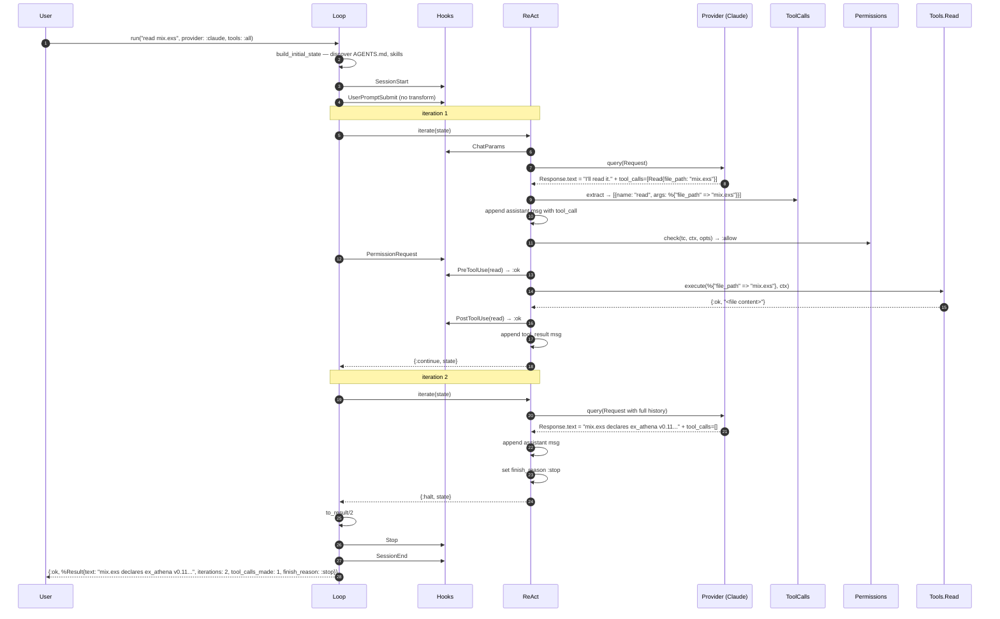
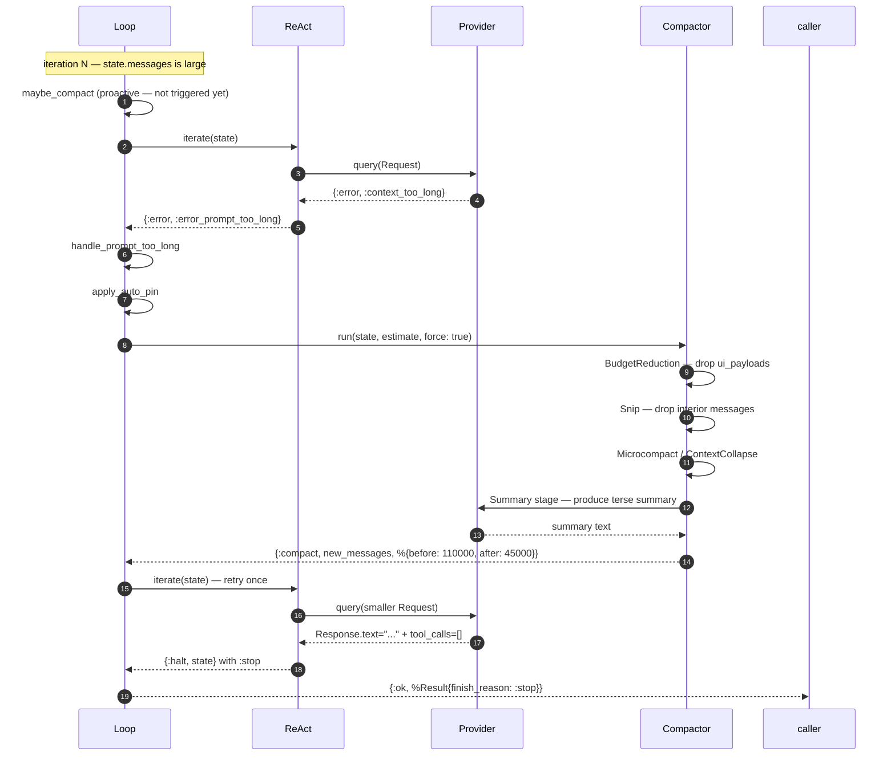
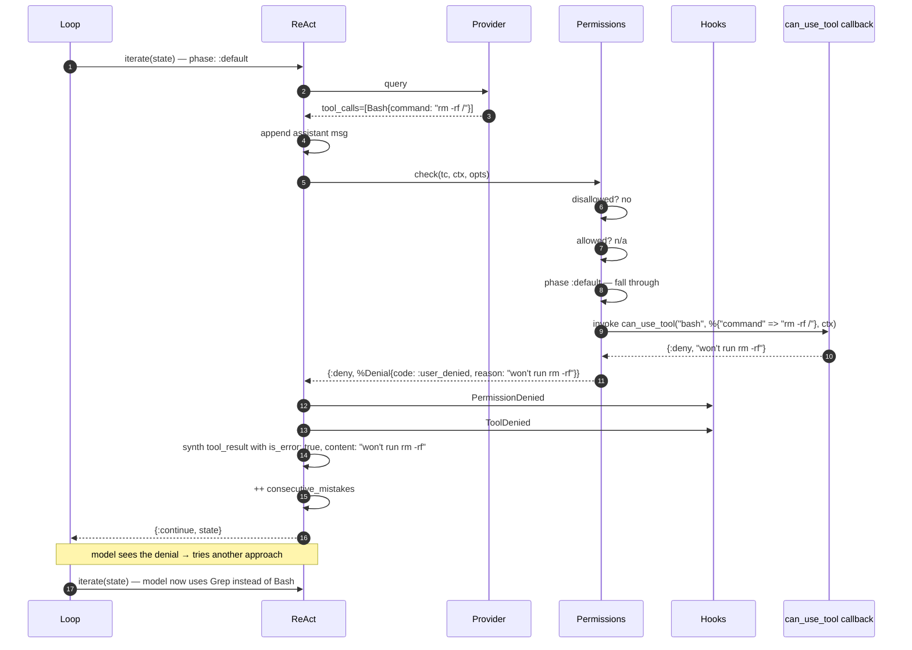
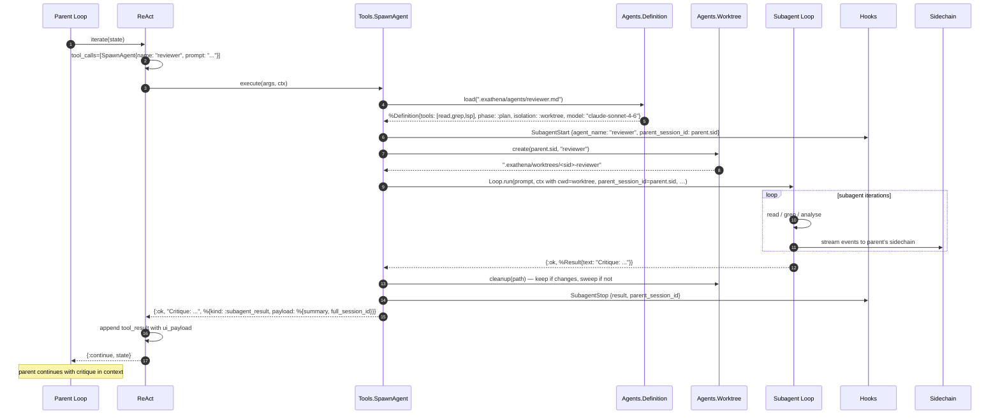
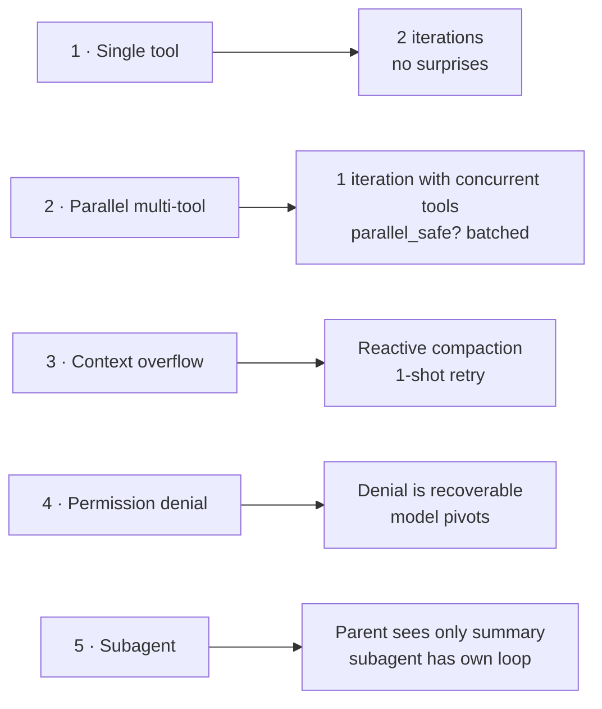

# 18 · End-to-End Traces

> **What this answers:** what does a real turn look like? Five annotated sequence diagrams of real flows.
> **Audience:** everyone. The fastest way to build a mental model.

---

## Trace 1 — Single tool call (`read mix.exs`)



**What to notice:**

- Two iterations: one for the tool call, one for the final answer.
- `consecutive_mistakes` reset to 0 on the successful tool execution ([`react.ex:118`](../lib/ex_athena/modes/react.ex#L118)).
- `Stop` hook fires before `SessionEnd`.

---

## Trace 2 — Parallel multi-tool turn (read + grep concurrently)

```mermaid
sequenceDiagram
  autonumber
  participant L as Loop
  participant R as ReAct
  participant P as Provider
  participant Par as Loop.Parallel
  participant T1 as Tools.Read
  participant T2 as Tools.Grep

  L->>R: iterate(state)
  R->>P: query(Request)
  P-->>R: Response.text="Let me investigate..." + tool_calls=[Read{mix.exs}, Grep{":ex_athena", "mix.exs"}]
  R->>R: append assistant msg with both tool_calls
  R->>Par: run([Read, Grep], state, &run_single_tool_call/2)
  Par->>Par: partition by parallel_safe? — both true
  par async_stream
    Par->>T1: execute(%{"file_path" => "mix.exs"}, ctx)
    T1-->>Par: {:ok, content}
  and
    Par->>T2: execute(%{"pattern" => ":ex_athena", "file_path" => "mix.exs"}, ctx)
    T2-->>Par: {:ok, "line 8: ..."}
  end
  Par-->>R: {:ok, [tool_result_read, tool_result_grep], state}
  R->>R: append both tool_results in tool_calls order
  R-->>L: {:continue, state}

  Note over L: iteration 2 — model summarises results
```

**What to notice:**

- Both tools `parallel_safe?: true`, batched via [`Loop.Parallel.run/3`](../lib/ex_athena/loop/parallel.ex).
- Results re-assembled in the order the model issued them, regardless of completion order.
- `tool_calls_made` increments by 2.

---

## Trace 3 — Context overflow + reactive recovery



**What to notice:**

- Mode returns the *typed* error so the kernel knows to attempt recovery (not just any error).
- `apply_auto_pin` protects paired tool_call/result messages from being orphaned by Summary.
- One-shot retry: if the second call also fails, terminates with `:error_prompt_too_long`.

---

## Trace 4 — Permission denial



**What to notice:**

- The model **sees the denial** as a tool_result and can try a different tool. Denial is recoverable, not terminal.
- `consecutive_mistakes` increments. Three denials in a row → `:error_consecutive_mistakes`.
- `PermissionDenied` and `ToolDenied` hooks fire for logging — they can't reverse the decision.

---

## Trace 5 — Subagent spawn



**What to notice:**

- The parent's Mode doesn't see the subagent's internal turns — only the final tool_result (with `ui_payload` for rich UI).
- `SubagentStart` / `SubagentStop` hooks fire on the parent's hook table.
- Subagent transcript is queryable via the sidechain (`parent_session_id`) but doesn't bloat the parent's messages.
- Worktree is kept if the subagent produced changes; otherwise auto-cleaned.

---

## Comparing the five traces



Each trace exercises a different piece of the kernel's contract:

| Trace | Showcases |
|---|---|
| 1 | Basic happy path, `:stop` termination, hook ordering |
| 2 | Parallel-safe batching, multi-tool turn |
| 3 | Reactive recovery, auto-pin, compaction pipeline |
| 4 | Deny-first gate, recoverable error path, mistake counter |
| 5 | Composition, worktree isolation, sidechain transcripts |

---

## Where to go next

- [03 · Reasoning loop](03-reasoning-loop.md) — the decision tree that drives all five traces.
- [07 · Tools](07-tools.md) → [08 · Permissions](08-permissions.md) → [09 · Hooks](09-hooks.md) — the three layers traversed in every tool-execution segment.
- [17 · Error recovery](17-error-recovery.md) — when a trace ends in something other than `:stop`.
